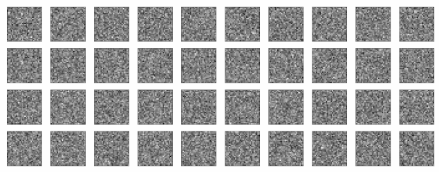

# Conditional Diffusion MNIST

This script is a minimalist implementation (~400 lines) of a conditional diffusion model. It learns to generate MNIST digits, conditioned on a class label. The neural network architecture is a small U-Net. This code is modified from [this excellent repo](https://github.com/cloneofsimo/minDiffusion) which does unconditional generation. The diffusion model is a [Denoising Diffusion Probabilistic Model (DDPM)](https://arxiv.org/abs/2006.11239).

Samples generated from the model.

The conditioning roughly follows the method described in [Classifier-Free Diffusion Guidance](https://arxiv.org/abs/2207.12598) (also used in [ImageGen](https://arxiv.org/abs/2205.11487). Essentially, the model infuses timestep embeddings $t_e$ and context embeddings $c_e$ with the U-Net activations at a certain layer $a_L$, via,

$a_{L+1} = c_e  a_L + t_e.$

Though in experimentation, we found variants of this also work, e.g. concatenating embeddings together.

At training time, $c_e$ is randomly set to zero with probability $0.1$, so the model learns to do unconditional (say $\psi(z)$ for some noise $z$) and conditional (say $\psi(z, c)$ for context $c$) generation. This is important as at generation time, we choose a weight, $w \geq 0$, to guide the model to generate examples with the following equation,

$\hat{\epsilon} = (1+w)\psi(z, c) + w \psi(z).$

Samples produced with varying guidance 'strength', $w$. Note that increasing $w$ produces images that are more typical but less diverse.

Training for above samples took around 20 epochs (~20 minutes).

